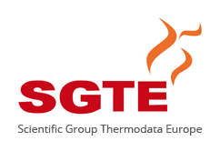

# SGTE ThermDoc database and exploration tools

SGTE ThermDoc Datatabase and exploration tools in command line for finding references about thermodynamical properties of multinaries and inorganic compounds. Research functions are similar to Papyrus except for the Graphic User Interface.

## A bit of history

SGTE is an international consortium created more than 40 years ago. SGTE focuses on providing physically validated thermochemical databases to be used by computational thermochemistry software tools. General databases on unaries, compounds, solutions are created and maintained as well as new databases dedicated to specific target applications meeting global challenges such as e-mobility, energy generation and conversion as well as life sciences are developed. 

The ThermDoc database itself is a collection of more than 100,000 literature references from 1848 to now, formatted in order to easily find data on multinaries and updated every year by leading members of the consortium. The aim of this public repository is to share the database and easy-to-use and open sourced exploration tools, with the maximum number of researchers around the world.

## Installation and use

- Install the multi-platforms [GNU Octave programming language for scientific computing](https://octave.org/) or use Matlab;
- Clone the repository to a local folder and go to the **./Code** folder **from the GNU Octave CLI or GUI**. GNU Octave command interface accepts most of the bash commands;
- Use the intuitive syntax from the command window to extract references from the ThermDoc database or execute scripts;
- Results are stored in the **./Search_results** folder, a file for each inquiry (results are just formatted in ASCII text file);
- *.m scripts can be edited with any tool (GNU Octave GUI, Notepad, Visual Studio Code, etc.);
- You can kill a running process at any time with Ctrl+C.

Each inquiry takes about 2-3 seconds on Matlab and about 10 seconds on GNU Octave but results are exactly the same. Each reference list will be sorted by descending year.

## Example of syntax
Here are some example of commands that can be used:

```matlab
Search_for_elements('Mo')           %search for citations about pure Molybdenum metal only
Search_for_elements('Al','Mo')      %search for citations about Al-Mo binary only
Search_for_elements('Al','Cu','Mo') %search for citations about Al-Cu-Mo ternary only
```
Any element can be added to the list. Inquiry is not case sensitive. The more the elements, the slower the search as any possible combination must be assessed (elements are not always listed by atomic mass in the database). The current version of the code does not allow yet to refine an enquiry (like papers about Mg-Al binaries from a particular author), may be programmed on request. This command is **case sensitive.**

```matlab
Search_for_authors('Chatillon','Nuta')  %search for Chatillon and Nuta as authors
```
The command extract references with Author#1 **AND** Author#2 **AND** Author#3, and so on. This command is **not accent or case sensitive.**

```matlab
Search_for_keywords('Plutonium','Osmium') %search for paper containing Plutonium and Osmium in the title
```
The command extract references with Keyword#1 **AND** Keyword#2 **AND** Keyword#3, and so on. This command is **not accent or case sensitive.**

Commands can of course be scripted and ran as a batch, see **[./Codes/Script.m](/Codes/Script.m)** for example of script containing several commands. Papers are listed by years to ease the reading and a command to extract certain years would have no purpose. These simple commands must cover 99% of the needs of database users.

## Database maintenance for administrators

Regular users are not supposed to perform this task as the provided files are up to date and easier to clone from the repository but if you want to update it whatever the reason, go to:
```
./Codes/Service_folder/Source_database/
```
And copy/paste the new database you want to process, update the name in [Service_script.m](/Codes/Service_folder/Service_script.m#L6), then run:
```matlab
./Codes/Service_folder/Service_script.m
```
The script will:
- detect any lacking field / inconsistency and report it in the **[./Codes/Service_folder/Error_outputs/](/Codes/Service_folder/Error_outputs)** folder. The original database contains lots of missinge titles, this is normal. Any other lacking field should be fixed soon;
- detect any issue in the "cle" field containing elements. Indeed, the elements list does not always end by / which slows down the search. It also adds a starting / to each "cle" to fasten search for multinaries;
- remove any accent from any European reference to avoid missing them by accident;
- sort and copy by descending year all entries of the original database to the working database;

The original database is never modified during the maintenance, all operations are made on the working database only. The service script take about 20 minutes on GNU Octave.

## Dev notes
- The codes attack the database in text format by brute force. It could appear slow but I've tried using more elaborated formats like structures and it does not speed up the process at all. It is slow because the database is huge.
- Additionnal commands can be made on request.

## License

- the GNU Octave codes provided are under the GPL-3.0 license
- the ThermDoc database is property of [SGTE - Scientific Group Thermodata Europe](https://www.sgte.net/en/)

## To cite the database in your work
- Citation reference to add
